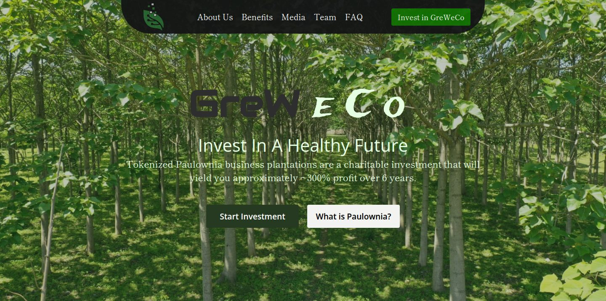
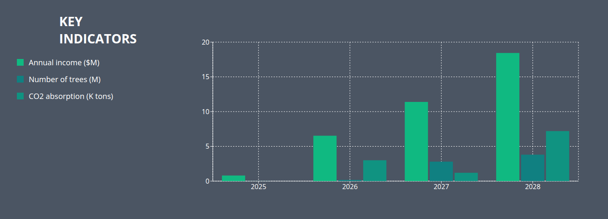
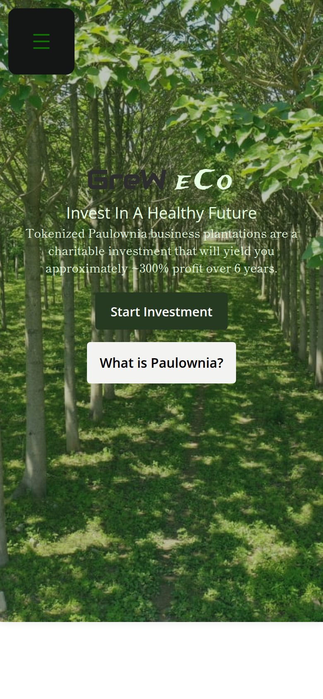

# GreWeCo — Tokenized Tree Plantation Website

Marketing website for GreWeCo, a project that tokenizes Paulownia tree plantations and offers the tokenized trees to investors. The site explains the model, the team, the sustainability goals, and the investment packages, in English and Georgian.

Live site: [grew.eco](http://www.grew.eco/)



| Key indicators chart | Mobile |
| --- | --- |
|  |  |

## Features

- English / Georgian language switcher (i18next)
- Business timeline and a key-indicators bar chart (Recharts)
- UN Sustainable Development Goals the project addresses
- "How does it work" explainer and investment package cards
- Team carousel (Swiper), media gallery, and custom video player
- FAQ accordion
- Investor Documents page with a downloadable pitch deck (`/investorDocs`)
- Responsive layout with a mobile menu

## Tech stack

- React 19
- Vite 7
- React Router 7 with hash links for in-page navigation
- i18next and react-i18next
- Recharts
- Swiper
- CSS Modules

## Run locally

Requires Node.js 20 or newer.

```bash
npm install
npm run dev      # start the dev server at http://localhost:5173
npm run build    # production build in dist/
npm run preview  # serve the production build
npm run lint
```

## Project structure

```text
src/
├── App.jsx                 routes: / and /investorDocs
├── Home.jsx
├── assets/                 images, video, and the pitch-deck PDF
└── components/
    ├── translation/        English and Georgian text
    ├── i18n.jsx            i18next setup
    └── *.jsx + *.module.css   page sections (Header, Timeline, Diagram, Goals, Faq, ...)
```
